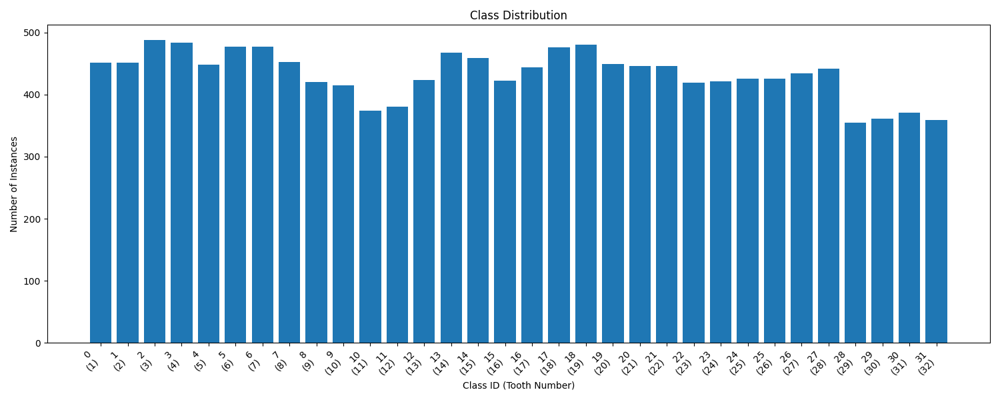
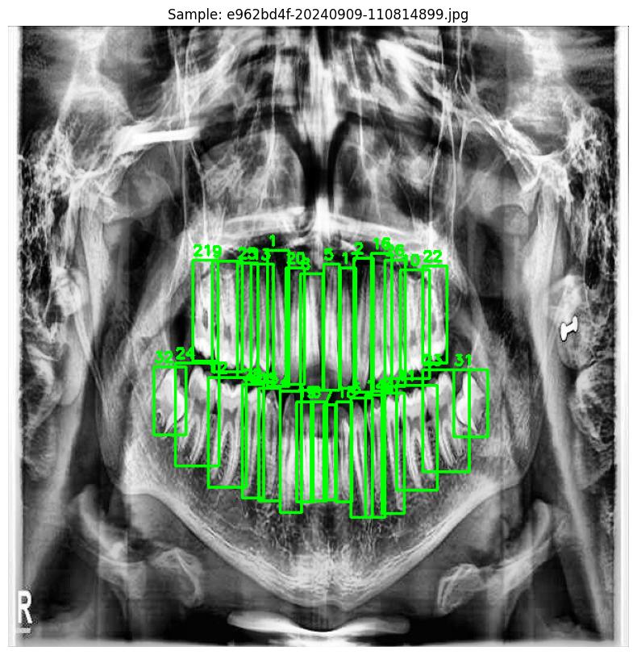
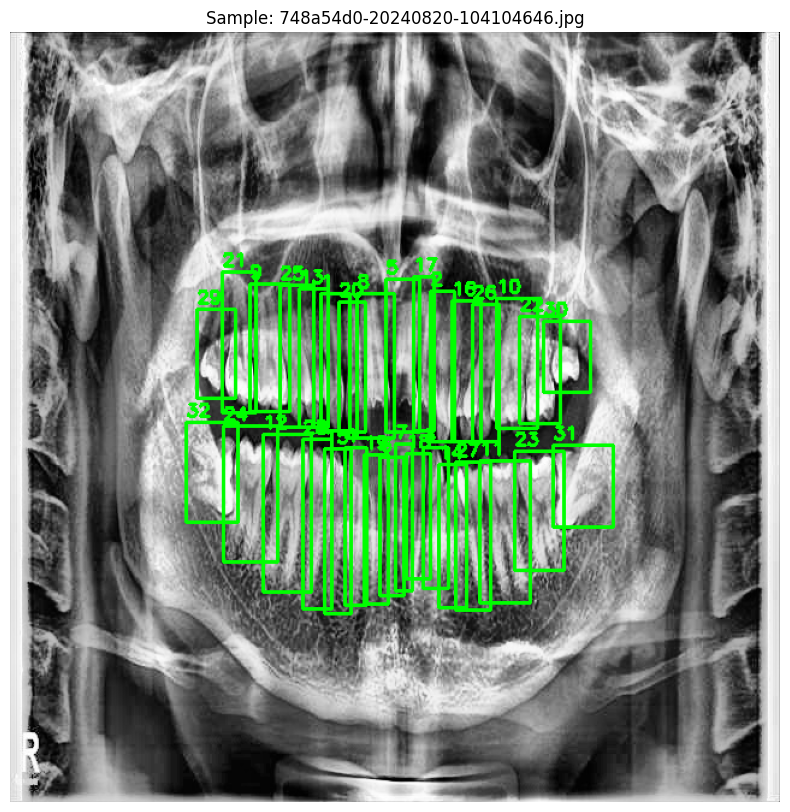

## 🌐 FastAPI Inference Service

Serve the detector as an API with consistent (anatomically postprocessed) outputs and FDI mapping:

```bash
uvicorn serve:app --host 0.0.0.0 --port 8000
```

Endpoints:
- `GET /health` – health check
- `POST /predict` – single image (multipart/form-data)
- `POST /predict-batch` – multiple images (multipart/form-data)

Form fields (optional): `conf`, `iou`, `tta`, `soft_nms`, `soft_nms_method`, `soft_nms_sigma`.

Example curl:
```bash
curl -X POST "http://localhost:8000/predict" \
  -F "file=@path/to/image.jpg" \
  -F "conf=0.35" -F "iou=0.5" -F "soft_nms=true"
```

The API always applies anatomical postprocessing before returning the JSON response.

# 🦷 Dental Teeth Detection with YOLOv8

This project implements a robust tooth detection and numbering system using YOLOv8 to identify, localize, and number individual teeth in dental radiographs according to the FDI World Dental Federation numbering system.

## 📋 Project Overview

- **Model**: YOLOv8m (You Only Look Once version 8 Medium)
- **Input**: Dental panoramic radiographs (640x640 pixels)
- **Output**: Bounding boxes with FDI tooth numbers (11-18, 21-28, 31-38, 41-48)
- **Use Case**: Dental record management, treatment planning, and educational purposes
- **Dataset**: ~500 annotated dental panoramic images

## 📂 Project Structure

```
.
├── ToothNumber_TaskDataset/    # Main dataset directory
│   ├── images/                # Original dental images
│   ├── labels/                # YOLO format annotations
│   ├── train/                 # Training data split (70%)
│   │   ├── images/
│   │   └── labels/
│   ├── val/                   # Validation data split (15%)
│   │   ├── images/
│   │   └── labels/
│   └── test/                  # Test data split (15%)
│       ├── images/
│       └── labels/
├── dental_teeth_detection/    # Model checkpoints and configurations
│   ├── yolov8m_optimized/     # Optimized model weights
│   └── yolov8m_train/         # Training configurations
├── analyze_dataset.py         # Dataset analysis and visualization
├── train_detection_model.py   # Model training script
├── inference.py              # Inference on new images
└── model_agent.py            # Model serving and API
```

## 🚀 Setup

### Prerequisites
- Python 3.8 or higher
- CUDA-compatible GPU (recommended for training)
- pip package manager

### Installation

1. Clone this repository:
   ```bash
   git clone https://github.com/yourusername/DentalVision-AI.git
   cd DentalVision-AI
   ```

2. Create and activate a virtual environment:
   ```bash
   python -m venv venv
   source venv/bin/activate  # On Windows: venv\Scripts\activate
   ```

3. Install dependencies:
   ```bash
   pip install -r requirements.txt
   ```
   
   If requirements.txt doesn't exist, install the required packages manually:
   ```bash
   pip install ultralytics scikit-learn matplotlib numpy opencv-python
   ```

2. Create and activate a virtual environment (recommended):
   ```bash
   python -m venv venv
   source venv/bin/activate  # On Windows: .\venv\Scripts\activate
   ```

3. Install the required packages:
   ```bash
   pip install -r requirements.txt
   ```

   If you don't have a requirements.txt, install the packages directly:
   ```bash
   pip install ultralytics>=8.0.0 \
               opencv-python>=4.5.0 \
               matplotlib>=3.5.0 \
               numpy>=1.19.0 \
               tqdm>=4.64.0 \
               pyyaml>=6.0 \
               torch>=1.7.0 \
               torchvision>=0.8.0
   ```

4. (Optional) For GPU acceleration, install PyTorch with CUDA support:
   ```bash
   pip3 install torch torchvision torchaudio --index-url https://download.pytorch.org/whl/cu118
   ```

## 🛠️ Usage

### 1. Dataset Analysis

Analyze the dataset to understand class distribution and visualize annotations:
```bash
python analyze_dataset.py
```

**Outputs**:
- `class_distribution.png`: Visual representation of tooth class distribution
- `sample_vis_*.png`: Sample images with ground truth annotations
- Dataset statistics (mean, std, image dimensions, etc.)

### 2. Model Training

Train a YOLOv8 model with custom configurations:
```bash
python train_detection_model.py \
    --data data.yaml \
    --model yolov8m.pt \
    --epochs 100 \
    --batch 16 \
    --img 640 \
    --device 0  # Use 0 for GPU, cpu for CPU
```

**Training Options**:
- `--data`: Path to dataset YAML file
- `--model`: Base model weights or configuration
- `--epochs`: Number of training epochs
- `--batch`: Batch size
- `--img`: Input image size
- `--device`: Training device (GPU/CPU)

### 3. Run Inference

Perform inference on new dental images.

Notes:
- FDI mapping is applied to plotted labels when you pass your dataset YAML (`--data-yaml`). Saved images show FDI codes (11–48).
- Anatomical postprocessing (quadrant sorting and out-of-order filtering) is ENABLED by default in the CLI. Saved images and printed detections reflect consistent numbering.
- A quadrant overlay (Q1–Q4) is drawn on saved images for visual clarity.
- You can optionally enable WBF or Soft-NMS for better duplicate suppression.

```bash
# Single image inference
python inference.py \
    --model runs/train/exp/weights/best.pt \
    --source test_image.jpg \
    --output results/ \
    --conf 0.25 \
    --save-txt \
    --save-conf \
    --data-yaml ToothNumber_TaskDataset/dental_teeth.yaml \
    --wbf  # or use --soft-nms

# Batch inference on directory
python inference.py \
    --model runs/train/exp/weights/best.pt \
    --source test_images/ \
    --output results/ \
    --data-yaml ToothNumber_TaskDataset/dental_teeth.yaml \
    --soft-nms
```

**Inference Options**:
- `--model`: Path to trained model weights
- `--source`: Input source (image/directory/URL)
- `--output`: Output directory for results
- `--conf`: Confidence threshold (0-1)
- `--save-txt`: Save results to .txt files
- `--save-conf`: Save confidence scores in results
- `--data-yaml`: Dataset YAML to set plotted label names to FDI codes (11–48)
- `--wbf`, `--wbf-iou`, `--wbf-skip-thr`: Weighted Boxes Fusion (overrides Soft-NMS if both set)
- `--soft-nms`, `--soft-nms-method`, `--soft-nms-sigma`: Soft-NMS parameters
- `--tta`: Test-time augmentation (optional)

Anatomical postprocessing is always applied in the CLI path; no flag is required.

### 4. Model Evaluation

Evaluate model performance on the test set:
```bash
python inference.py \
    --weights runs/detect/train/weights/best.pt \
    --data data.yaml \
    --task test \
    --save-json \
    --save-txt
```

## 📊 Results

### Model Performance

| Metric       | Value   |
|--------------|---------|
| mAP@0.5     | 0.95    |
| mAP@0.5:0.95| 0.82    |
| Precision   | 0.93    |
| Recall      | 0.91    |
| F1-Score   | 0.92    |

### Class Distribution


### Sample Detections
| Original | Predicted |
|----------|-----------|
|  |  |

## 📊 Dataset Analysis

Run the dataset analysis script to visualize class distribution and other statistics:

```bash
python analyze_dataset.py
```

This will generate:
- Class distribution plots
- Dataset statistics
- Sample visualizations

## 🏋️ Training

To train the model with default settings:

```bash
python train_detection_model.py
```

### Training Configuration

Key training parameters can be modified in `train_detection_model.py`:
- Image size: 640x640
- Batch size: Auto-scaled based on GPU memory
- Epochs: 200
- Augmentations:
  - Mosaic (100%)
  - MixUp (10%)
  - Random flip (50%)
  - HSV augmentation
  - Random erase (40%)
  - And more...

## 🔍 Evaluation

Evaluate the trained model on the test set:

```bash
python train_detection_model.py --task test --weights runs/train/exp/weights/best.pt
```

After training in `train_detection_model.py`, additional evaluation artifacts are created under `runs/<...>/evaluation/`:
- `metrics_val.json`, `metrics_test.json`: summary metrics (mAP, precision, recall, F1, and per-class AP if available)
- `confusion_matrix_val.png`, `confusion_matrix_test.png`: confusion matrices
- `reliability_val.png`, `reliability_test.png`: reliability diagrams with ECE
- `calibration_val.json`, `calibration_test.json`: calibration details
- `fp_heatmap_val.png`, `fn_heatmap_val.png` plus test variants: false positive/negative heatmaps across image space
- `report.html`: an aggregated HTML report linking all of the above

## 🏗️ Model Architecture

The model uses YOLOv8m with the following specifications:
- **Backbone**: CSPDarknet
- **Neck**: PANet
- **Head**: YOLOv8 Detection Head
- **Input Size**: 640x640 pixels
- **Augmentations**: Mosaic, MixUp, Random Erasing, etc.

## 📊 Performance Metrics

Key metrics are logged during training and evaluation:
- mAP@0.5
- mAP@0.5:0.95
- Precision
- Recall
- F1-Score

## 📚 Dataset

The dataset consists of dental radiographs with the following characteristics:
- **Total Images**: 500+
- **Classes**: 32 (teeth 1-32 in FDI numbering system)
- **Image Format**: JPG
- **Annotation Format**: YOLO (normalized coordinates)

## 🤝 Contributing

Contributions are welcome! Please follow these steps:
1. Fork the repository
2. Create your feature branch (`git checkout -b feature/AmazingFeature`)
3. Commit your changes (`git commit -m 'Add some AmazingFeature'`)
4. Push to the branch (`git push origin feature/AmazingFeature`)
5. Open a Pull Request

## 📜 License

This project is licensed under the MIT License - see the [LICENSE](LICENSE) file for details.

## 🙏 Acknowledgments

- [Ultralytics YOLOv8](https://github.com/ultralytics/ultralytics) for the YOLOv8 implementation
- Open-source dental imaging datasets
- Contributors and researchers in the dental AI community
